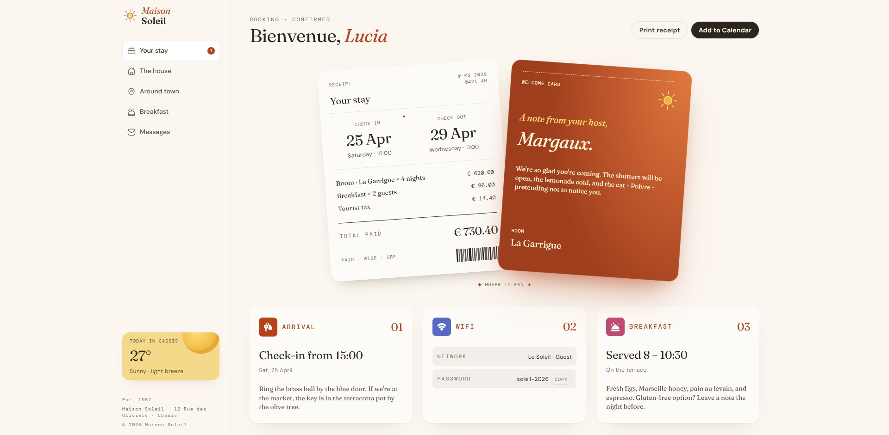

# Frontend Mentor - Hotel booking confirmation page solution

This is a solution to the [Hotel booking confirmation page challenge on Frontend Mentor](https://www.frontendmentor.io/challenges/hotel-booking-confirmation-page). Frontend Mentor challenges help you improve your coding skills by building realistic projects. 

## Table of contents

- [Overview](#overview)
  - [The challenge](#the-challenge)
  - [Screenshot](#screenshot)
  - [Links](#links)
- [My process](#my-process)
  - [Built with](#built-with)
- [Author](#author)

**Note: Delete this note and update the table of contents based on what sections you keep.**

## Overview

### The challenge

Users should be able to:

- View the optimal layout for the interface depending on their device's screen size
- See hover and focus states for all interactive elements on the page
- Open and close the navigation menu on smaller screens (optional JavaScript)
- Copy the Wi-Fi password to their clipboard using the copy button (optional JavaScript)

### Screenshot

### Links

- Solution URL: [repo](https://github.com/paliss9001/paliss9001.github.io)
- Live Site URL: [web address](https://paliss9001.github.io/)

## My process

### Built with

- [Sass/SCSS](https://sass-lang.com/) - CSS preprocessor language

## Author

- Frontend Mentor - [username](https://www.frontendmentor.io/profile/paliss9001)
